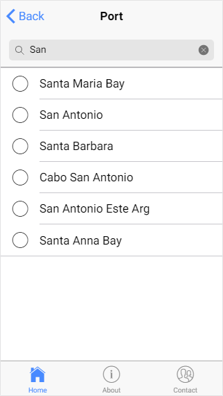
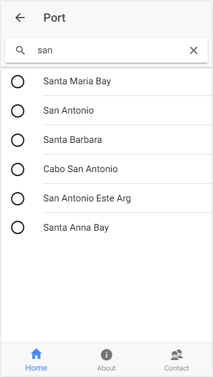

[npm-image]: https://img.shields.io/npm/v/ionic-select-searchable.svg
[npm-url]: https://npmjs.org/package/ionic-select-searchable
[downloads-image]: https://img.shields.io/npm/dm/ionic-select-searchable.svg

# Ionic Select with Searchbar
[![NPM Version][npm-image]][npm-url]
[![NPM Downloads][downloads-image]][npm-url]

An Ionic component similar to `ion-select`, that allows to search items, including async search and infinite scrolling.

# Contents
* [Demo](#demo)
* [Download](#download)
* [Getting started](#getting-started)
* [API documentation](../../wiki/API-Documentation)
* [Development](#development)

## Demo
* [Github demo app](https://github.com/eakoriakin/ionic-select-searchable-demo)
* [Plunker](http://plnkr.co/edit/YzCBKS?p=preview)

### iOS



### Android



## Download
Download it using npm:

`npm install ionic-select-searchable --save`

## Getting started

1. Import `SelectSearchable` to your main app module.
```
import { NgModule } from '@angular/core';
import { SelectSearchableModule } from 'ionic-select-searchable';

@NgModule({
    ...
    imports: [
        ...
        SelectSearchableModule
    ],
    ...
})
export class AppModule { }

```
2. Add `SelectSearchable` to your component template.
```
<ion-item>
    <select-searchable
        title="Port"
        [(ngModel)]="port"
        [items]="ports"
        itemValueField="id"
        itemTextField="name"
        [canSearch]="true"
        (onChange)="portChange($event)">
    </select-searchable>
</ion-item>
```
3. Prepare your component file for `SelectSearchable`.
```
import { Component } from '@angular/core';
import { SelectSearchable } from 'ionic-select-searchable';

class Port {
    public id: number;
    public name: string;
}

@Component({
    ...
})
export class HomePage {
    ports: Port[];
    port: Port;

    constructor() {
        this.ports = [
            { id: 1, name: 'Tokai' },
            { id: 2, name: 'Vladivostok' },
            { id: 3, name: 'Navlakhi' }
        ];
    }

    portChange(event: { component: SelectSearchable, value: any }) {
        console.log('port:', event.value);
    }
}
```

## Development
1. Install dependencies.  
`npm install`  
2. Start build.  
`gulp`  
